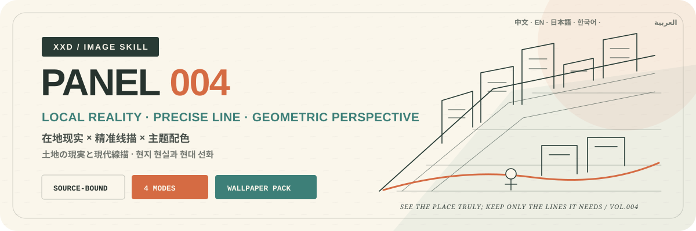
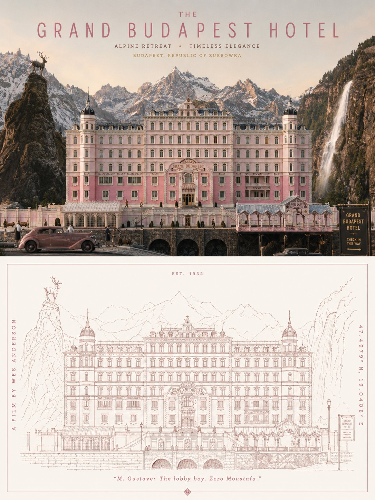
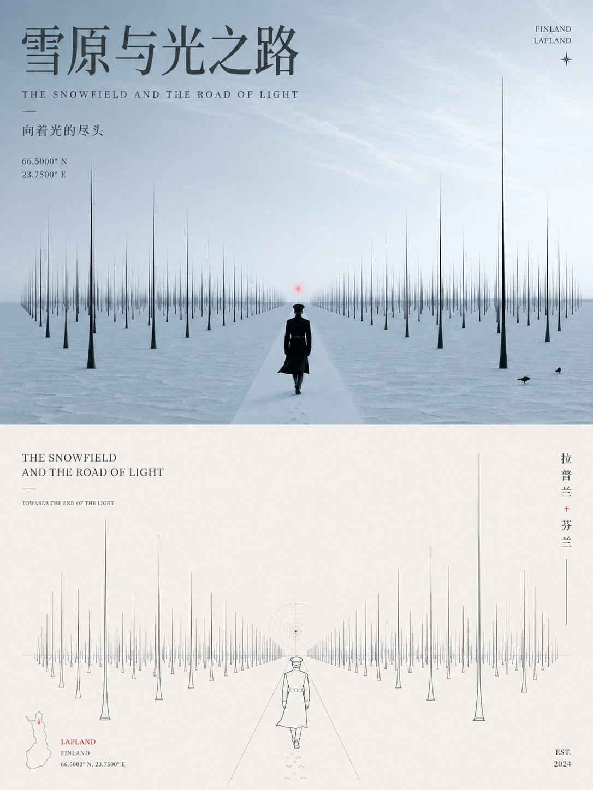
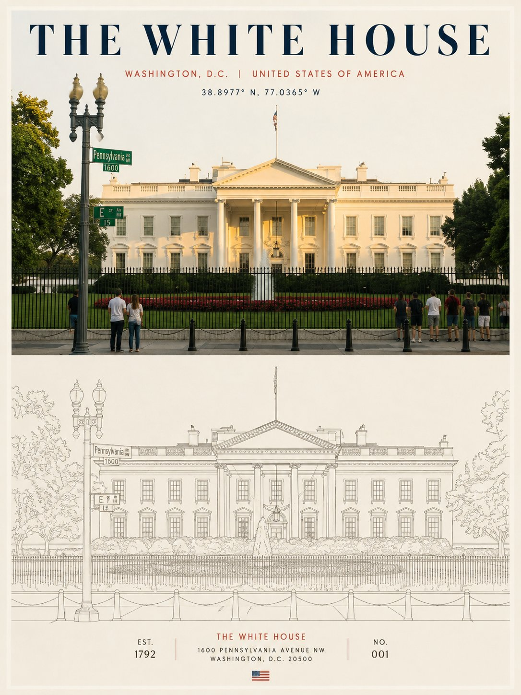
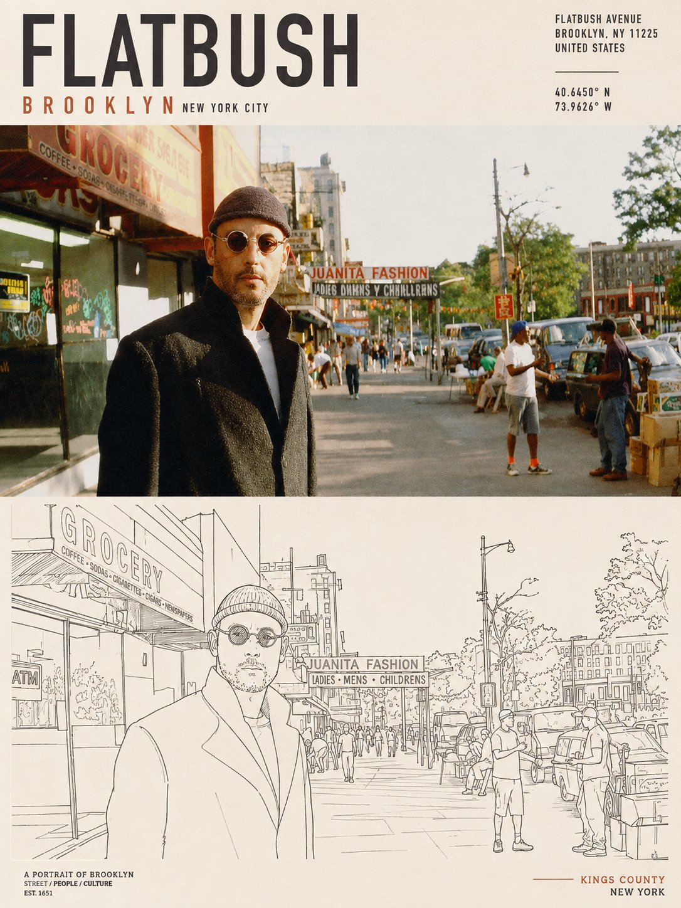

<p align="center">
  
</p>

<div align="center">

# 🦁 XXD Panel 004

### 从一个可信的现实场景，提炼出收藏级的现代主题线描海报

[](./SKILL.md)
[](#四种输出共享同一种现实线描逻辑)
[](#边界与信任)

<strong>简体中文</strong> · <a href="README.en.md">English</a> · <a href="README.ja.md">日本語</a> · <a href="README.ko.md">한국어</a> · <a href="README.ar.md">العربية</a>

</div>

> 在地现实 · 精准单线 · 几何透视 · 主题配色 · 城市品牌文字

XXD Panel 004 是一个面向 Codex 与兼容 Agent 的图像生成 Skill。它接受主题、地点、地址、坐标或参考图：先建立一幅完整、统一、真实且有日常温度的现实场景，再从同一场景中提炼最有辨识度的天际线、街道界面、招牌节奏、交通设施、橱窗关系、人群状态或主题结构，转化为纤细准确、透视清楚、安静现代的线描海报。

画面不复制照片表面，而是从源图事实中找到一个聪明、轻巧、可回看的视觉转化。它融合现代主义编辑插画、包豪斯秩序、绘本温度和时装速写的松弛感；文字像画者顺手留下的克制手写注记，而不是后来贴上去的广告标题。

## 为什么需要 004

普通“城市海报”很容易退化成地标拼贴、明信片夕阳、旅游贴纸和通用天际线；主题只剩名称，任何城市都能互换。

004 的顺序完全相反：

```text
确认主题与可靠事实 → 建立一幅统一的现实场景定调图 → 锁定三个以上在地或主题线索 → 用精准单线与几何透视提炼 → 从气候、光线、材料和文化情绪推导配色 → 把标题与地点信息纳入同一网格
```

如果换成另一个城市或主题，现实场景、线描结构、透视、当地文字、配色和文案仍然成立，这张图就不属于 004。

## 004 的视觉契约

- **可信现实场景：** 参考图、地址、坐标和可靠事实优先；城市元素在同一空间自然共生，不拼贴景点、不杜撰招牌。
- **主题专属识别：** 至少保留三个在地或主题线索，例如天际线、街道方向、立面开口、招牌节奏、交通设施、人群状态或核心结构。
- **精准线描转译：** 用纤细单线、清楚透视、遮挡关系和适度抽象提炼，而不是逐边描摹或套图标。
- **有秩序的细节：** 通过线密度、间距、重叠、留白和少量局部压重形成丰富度，不做写实明暗。
- **服务结构的几何：** 水平基线、纵向构成线和透视辅助线只用于对齐、层级与节奏。
- **主题专属配色：** 单色或极少量色彩来自气候、光线、时间、材料、历史、商业、饮食、自然与情绪。
- **收藏级文字系统：** 一个清晰主标题与零至三条可靠辅助信息共同进入网格；当地语言、地址、坐标、年份和店招不得编造。

## 样张 · 来自 X

> [小小东（@xiaoxiaodong01）](https://x.com/xiaoxiaodong01/status/2089972269724619259) · 2026-08-19<br>
> GPT2 x 转绘 x 规则线条 x 美学提示词 x VOL.004

<table>
  <tr>
    <td width="50%"><a href="https://x.com/xiaoxiaodong01/status/2089972269724619259"></a></td>
    <td width="50%"><a href="https://x.com/xiaoxiaodong01/status/2089972269724619259"></a></td>
  </tr>
  <tr>
    <td width="50%"><a href="https://x.com/xiaoxiaodong01/status/2089972269724619259"></a></td>
    <td width="50%"><a href="https://x.com/xiaoxiaodong01/status/2089972269724619259"></a></td>
  </tr>
</table>

<p align="center"><a href="https://x.com/xiaoxiaodong01/status/2089972269724619259">查看原推文与完整提示词 →</a></p>

这些样张用于展示 004 的美学动机，不会把样张中的主体、构图、配色、文案或旧画幅变成生成参考或当前默认值。

## 原始提示词优先，而不是二次导演

`references/004-source.md` 是本项目唯一的创作与审美权威。Skill 不再额外总结或扩写它，也不会统一规划颜色、色板、美学动机、标题或微文案。原始提示词要求怎样处理颜色、材料、构图、留白与文字，GPT Image 2 就按那套逻辑执行。

模式与尺寸只覆盖原始提示词旧有的 3:4 上下双联容器：在左右模式中，“上方照片／下方设计”分别映射为左侧／右侧；在只要设计图和壁纸模式中，下方设计审美扩展到完整画布。除此之外，原始提示词全部保持有效。

## 四种可组合输出模式

模式可以单选或多选：`top-bottom`、`left-right`、`design-only`、`wallpaper-pack`。双联默认由图像模型一次生成完整画布；只有完整画布重试失败、要求原片逐像素不变或需要无损尺寸校准时，才使用拼合脚本兜底。

上下或左右区域的均衡关系只是视觉构图目标，不做分界线、中线百分比或像素坐标检测。轻微偏移不构成失败；只有用户明确要求像素级精确分区时，才使用确定性拼合。

普通成品尺寸同样可以多选：自动适配、跟随原图、1:1、3:4、4:3、4:5、5:4、2:3、3:2、9:16、16:9、21:9、5:7、7:5，或自定义比例／准确像素。没有静默默认尺寸；每个不同比例都会基于同一份原始提示词独立重构。

壁纸套装可选“连贯”或“四张独立”。连贯模式先生成一张定调图，其余设备同时参考原图与定调图重新构图；不会把一张图机械裁成四种尺寸。

## 文字方式

正式生图前只确认三种选择：

1. **模型根据原始提示词生成文字**：用户只指定语言或地区，文字内容、数量、气质与排版由 GPT Image 2 按原始提示词生成。
2. **使用我的准确文字**：逐字传给图像模型，不改写、不翻译、不补标题；排版仍遵循原始提示词。
3. **不要文字**：严格禁止文字与伪文字。

外层 Skill 不再预编标题、微文案或文案包。文字语言与操作语言分开确认，不根据人物、场景或文件名猜测国家与受众。

## 完整画布优先与位图边界

图像模型负责整张成品的审美重构，双联也默认一次直出完整画布。`scripts/compose_panel.py` 只保留为条件明确的兜底、无创尺寸校准和只读审计工具，不再预先规划每次任务，也不评价审美是否成功。

全部交付为 PNG 位图。每次调用都在 `~/Desktop/xxd/` 下创建新任务；已配置图像通道只返回脱敏状态，不公开供应商、端点、凭据、请求头、提示词、响应或账户信息。SVG、HTML、Canvas、图表和程序绘图不能替代最终作品。

## 能力自适应问询与快捷参数

同一个 Skill 会根据宿主真正提供的交互能力选择界面，不会把文本符号伪装成可点击控件：

- **Claude Code 提供 `AskUserQuestion + multiSelect: true` 时**：模式和尺寸使用真正的 checkbox；文字方式与壁纸关系使用单选。常用尺寸会按方形、竖版、横版分组展示，并累计多组选项；自定义尺寸进入自由输入。
- **Codex 只提供 `request_user_input` 时**：它只用于文字方式、壁纸关系等互斥单选，不拿来伪装模式或尺寸多选。模式与尺寸改用清楚的组合输入。
- **没有交互工具时**：使用两轮文字问询。第一轮选择一个或多个模式；第二轮填写尺寸与文字方式。Skill 不显示假的 `- [ ]`，也不会为了获得表单要求用户切换 Plan mode。

默认第二轮只展示“智能推荐／跟随原图／常用比例／自定义”四个入口；只有选择常用比例时，才展开完整比例库：方形 `1:1`，竖版 `3:4、4:5、2:3、9:16、5:7`，横版 `4:3、5:4、3:2、16:9、21:9、7:5`。所有比例都可组合，也可直接输入准确像素。

全部设置都可以直接作为参数传入：

```text
/xxd-panel-004 photo.jpg --mode top-bottom,design-only --size auto,3:4,9:16 --text prompt --locale ja-JP
```

支持 `--mode`、可重复或逗号分隔的 `--size`、`--text prompt|exact|none`、`--locale`、`--copy`、`--wallpaper linked|independent`、`--wallpaper-size` 和 `--out`。参数齐全时跳过全部问询；参数不完整时只询问缺失项。

## 生图模型优先级

GPT Image 2 是默认首选，并继续执行本项目现有的高保真垫图、生成前确认整张画幅、双联一次生成完整画布、脚本仅作条件式兜底等逻辑。

当当前工具或已配置兼容通道确实可用，并能满足原图保真、整张成品比例、目标语言文字和连贯壁纸多图参考等要求时，也支持 Seedance 5.0 Pro、Nano Banana Pro（Gemini Image Pro）、Nano Banana 2（Gemini Image Flash）或其他兼容位图模型。备用模型只替换生成通道，不得改变模式、画幅、文案、语言、壁纸关系和完整画布优先策略。

如果没有合适的生图通道，Skill 会请用户启用生图工具或提供 API Key。用户主动提供的凭据可以用于当前任务，但不得在回复或日志中回显、展示或泄露；未经用户明确要求，不会长期保存凭据或修改供应商、账户、计费及全局路由配置。

## 开始使用

```bash
git clone https://github.com/nevertoday/xxd-panel-004.git
mkdir -p ~/.codex/skills
ln -s "$(pwd)/xxd-panel-004" ~/.codex/skills/xxd-panel-004
```

Claude Code 用户可以把同一目录链接到 `~/.claude/skills/xxd-panel-004`。安装后重新启动 Agent 会话。

```text
$xxd-panel-004
把这张照片做成左右双联，文案由你根据照片内涵创作，使用自然韩语。
```

只给主题或上传参考图都可以调用。Skill 会先询问一个或多个模式、主题输入所需画幅与文字设置；选择壁纸时还会确认连贯或独立以及设备尺寸。

完整规范：

- [Skill 工作流](SKILL.md)
- [中文运行适配器](references/xxd-panel-004-prompt.zh-CN.md)
- [英文运行适配器](references/xxd-panel-004-prompt.en.md)
- [原始风格提示词](references/004-source.md)

## 边界与信任

- 每张照片只在自己的任务中使用，不借用其他输入、旧成品或样张里的主体、颜色、文案和构图。
- 每次调用都创建新的任务子文件夹；相同原图和参数也要重新生成，旧成品不能冒充当前任务。
- 最终交付为 PNG 位图，不是 SVG、HTML、Canvas 或程序绘图替代品。
- 已配置位图桥接只返回脱敏状态，不显示供应商、端点、请求头、凭据、提示词或服务器响应正文。
- 每个所选普通模式各返回一张；若选择 `wallpaper-pack`，再返回四张独立壁纸。选择 `全部` 时每张原图共返回 7 个 PNG，分处四个同级模式文件夹，绝不生成拼贴总览。

本地拼版需要 Python 3 和 Pillow。安全位图桥接使用 Python 3.11+ 的 `tomllib`。图像生成仍需要主机 Agent 的内置位图能力或已经配置好的兼容位图路径。

## 项目结构

```text
xxd-panel-004/
├── SKILL.md
├── README.md / README.en.md / README.ja.md / README.ko.md / README.ar.md
├── agents/openai.yaml
├── assets/
│   ├── banner.svg
│   └── examples/（未来本地样张占位）
├── scripts/
│   ├── compose_panel.py
│   └── configured_imagegen.py
└── references/
    ├── xxd-panel-004-prompt.zh-CN.md
    ├── xxd-panel-004-prompt.en.md
    └── 004-source.md
```

## 关于 XXD

XXD 是小小东的品牌名称缩写。项目由 [@xiaoxiaodong01](https://x.com/xiaoxiaodong01) 创建并维护。

## 服务与会员

### 深度咨询 · 299 元/小时

Skills 使用的一对一深度咨询按 299 元/小时收费。请通过下方微信二维码联系小小东预约。

### 小小东 Skills 用户交流群 · 入群 99 元

一次支付 99 元加入用户交流群，用于交流工作流、作品与互助；不包含按小时的一对一深度咨询。扫码后请备注“Skills 用户交流群”。

### 知识星球＋成员提示词库 · 699 元/年

[知识星球](https://wx.zsxq.com/group/15554814142882)与[小小东成员提示词库](https://vip.xiaoxiaodong.ai/)是同一份会员权益：**一次年费同时开通两边，无需重复付费。**

1. 在[知识星球](https://wx.zsxq.com/group/15554814142882)开通后，微信联系小小东领取成员提示词库兑换码。
2. 在[成员提示词库](https://vip.xiaoxiaodong.ai/)自助开通后，微信联系小小东邀请进入知识星球。

<p align="center">
  <a href="https://xiaoxiaodong.pages.dev/assets/wechat-qr.png"></a>
</p>

<div align="center">

**先把地方看真，再用最少的线把它留下。**

</div>

---

<div align="center">
  <h2>☕ 为开源项目赞助算力</h2>
  <p>如果这个项目为你节省了时间，可以通过微信或支付宝赞助后续测试与生成算力。</p>
  <table>
    <tr>
      <td align="center" width="240">
        <a href="https://colors.xiaoxiaodong.ai/docs/images/wechat-reward-qr.png"></a><br>
        <strong>微信算力赞助</strong>
      </td>
      <td align="center" width="240">
        <a href="https://colors.xiaoxiaodong.ai/docs/images/alipay-reward-qr.png"></a><br>
        <strong>支付宝算力赞助</strong>
      </td>
    </tr>
  </table>
  <p><sub>赞助完全自愿，不会改变这个开源项目的使用权限。</sub></p>
</div>
